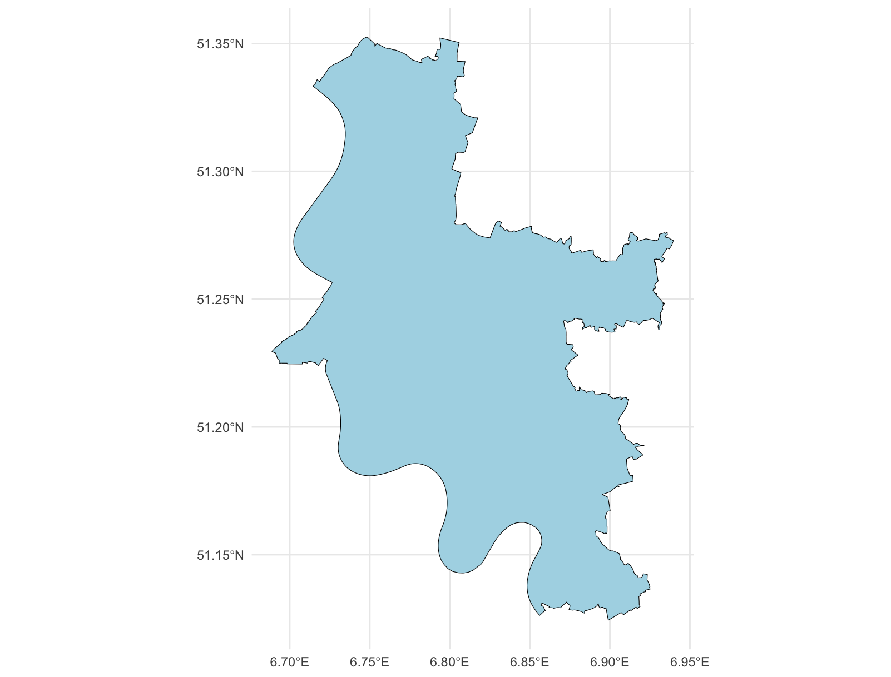
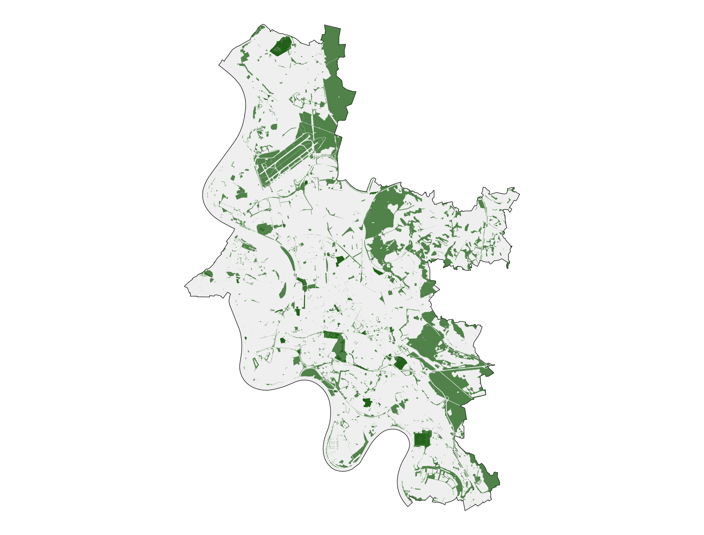
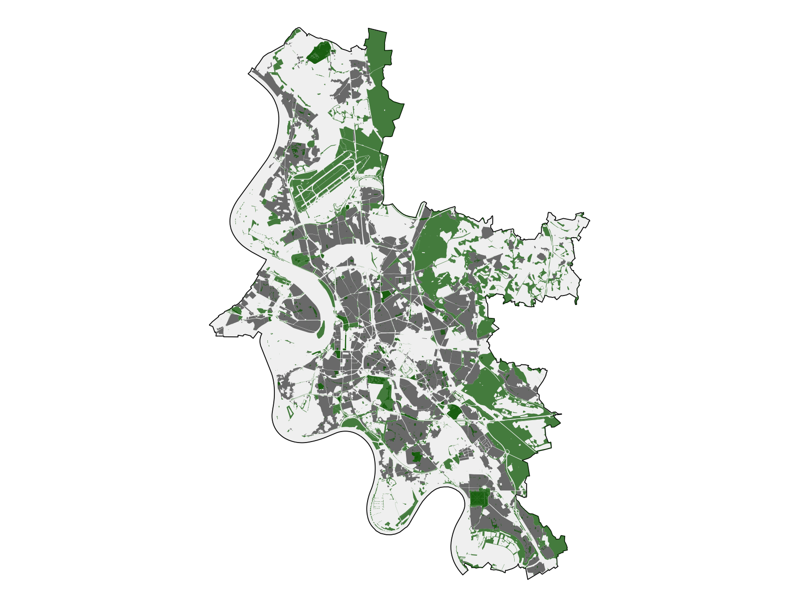
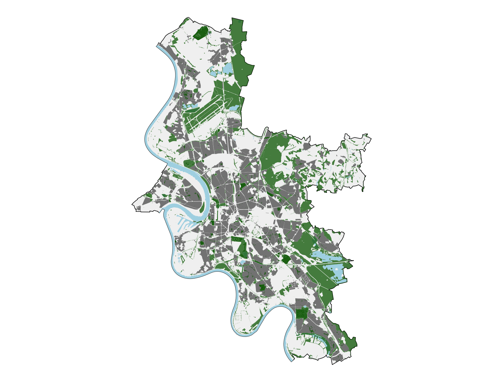
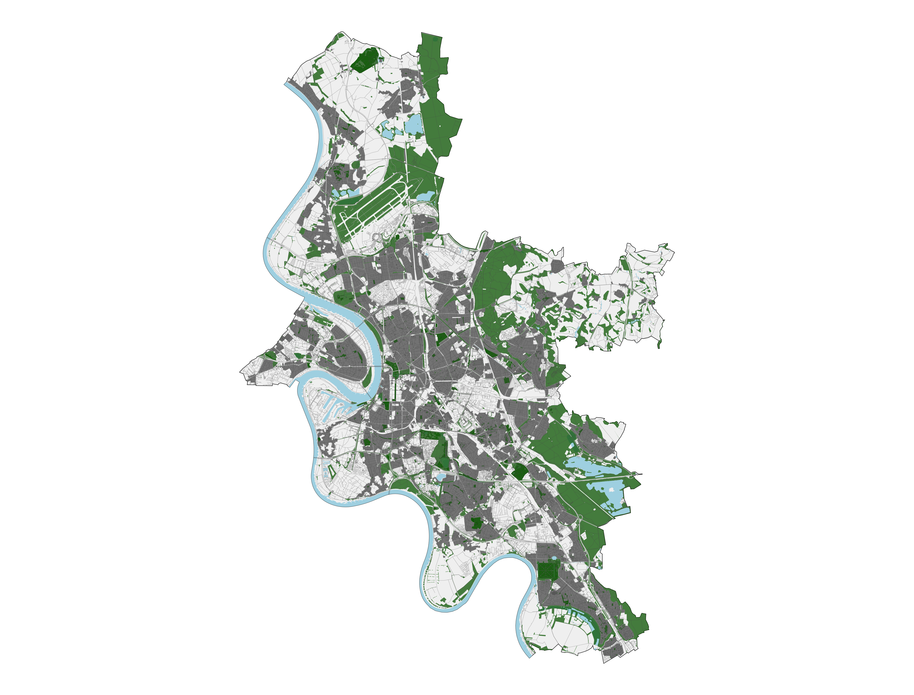
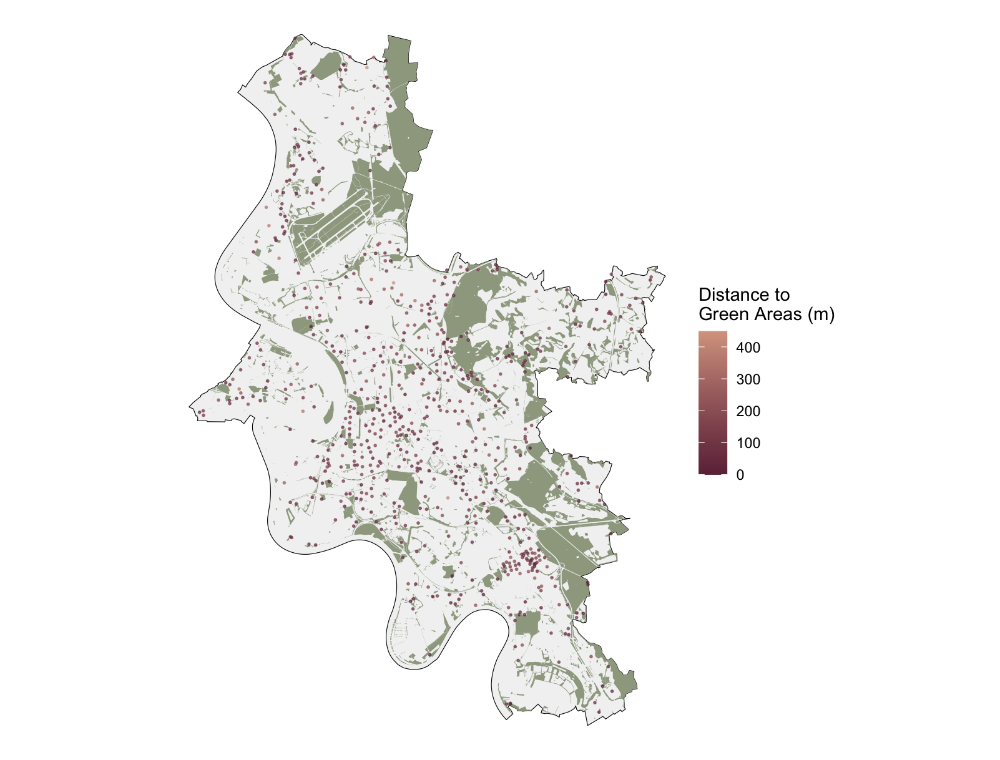
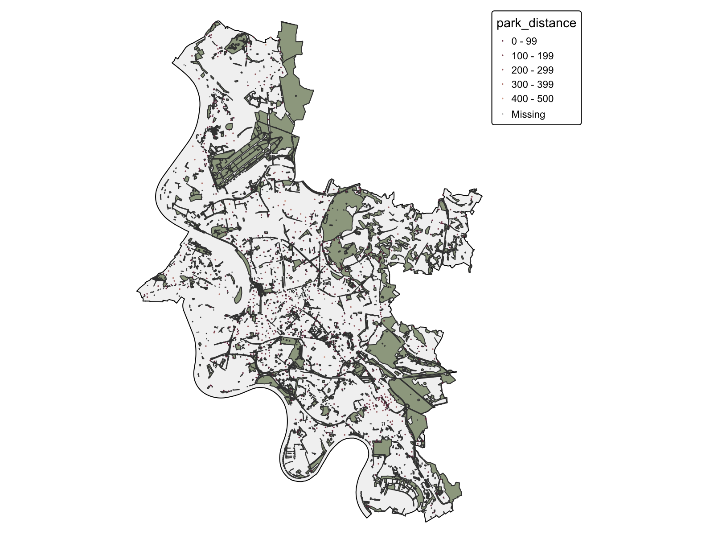

```{=html}
<style>
@import url('https://fonts.googleapis.com/css2?family=Inter:wght@400;500;600;700;800;900&display=swap');

:root{
  --blue:#41bff2;
  --dark:#080808;
  --light:#f3f4f5;
  --muted:#62666d;
  --white:#ffffff;
}

*{box-sizing:border-box;}

body{
  margin:0;
  font-family:'Inter', Arial, sans-serif;
  color:var(--dark);
  background:white;
}

#title-block-header{display:none;}

.topbar{
  height:78px;
  position:sticky;
  top:0;
  z-index:100;
  background:white;
  border-bottom:1px solid #e5e5e5;
  display:flex;
  align-items:center;
  justify-content:space-between;
  padding:0 6vw;
}

.brand{
  font-weight:900;
  font-size:15px;
  line-height:.95;
  letter-spacing:.16em;
}

.brand small{
  display:block;
  font-size:9px;
  margin-top:5px;
  letter-spacing:.08em;
}

.nav-btn{
  background:var(--blue);
  color:#000;
  padding:15px 30px;
  border-radius:999px;
  text-decoration:none;
  font-weight:900;
  font-size:18px;
}

.hero{
  min-height:760px;
  background:var(--light);
  display:grid;
  grid-template-columns:1fr 1fr;
  gap:50px;
  align-items:center;
  padding:80px 6vw;
}

.hero h1{
  font-size:clamp(58px, 8vw, 110px);
  line-height:.9;
  letter-spacing:-.07em;
  text-transform:uppercase;
  margin:0 0 30px;
  font-weight:900;
}

.hero p{
  font-size:24px;
  line-height:1.45;
  max-width:680px;
  color:#333;
}

.pills{
  display:flex;
  flex-wrap:wrap;
  gap:14px;
  margin-top:35px;
}

.pill{

  border:2px solid #111;

  padding:13px 22px;

  border-radius:999px;

  font-weight:900;

  text-decoration:none;

  color:#000;

  display:inline-block;

}

.pill.blue{

  background:var(--blue);

  border-color:var(--blue);

}

.hero-card{
  background:white;
  border-radius:42px;
  padding:28px;
}

.hero-card img{
  width:100%;
  border-radius:32px;
  display:block;
}

.section{
  padding:100px 6vw;
}

.section.light{
  background:var(--light);
}

.section.dark{
  background:#111;
  color:white;
}

.section-title{
  font-size:clamp(42px, 5vw, 76px);
  line-height:.95;
  letter-spacing:-.06em;
  font-weight:900;
  margin:0 0 22px;
}

.section-lead{
  max-width:850px;
  font-size:21px;
  line-height:1.55;
  color:#444;
  margin:0 0 50px;
}

.dark .section-lead{
  color:#d5d5d5;
}

.grid-4{
  display:grid;
  grid-template-columns:repeat(4,1fr);
  gap:24px;
}

.card{
  background:#f3f4f5;
  border-radius:30px;
  padding:34px;
  min-height:220px;
}

.card .label{
  color:#0076a8;
  font-weight:900;
  margin-bottom:28px;
}

.card h3{
  font-size:30px;
  letter-spacing:-.04em;
  margin:0 0 15px;
}

.card p{
  color:#62666d;
  font-size:17px;
  line-height:1.5;
}

.map-block{
  display:grid;
  grid-template-columns:.7fr 1.3fr;
  gap:34px;
  align-items:stretch;
  margin-top:44px;
}

.map-block.reverse{
  grid-template-columns:1.3fr .7fr;
}

.text-panel{
  background:white;
  border-radius:36px;
  padding:44px;
  display:flex;
  flex-direction:column;
  justify-content:space-between;
}

.text-panel .tag{
  color:#0076a8;
  font-weight:900;
  font-size:18px;
}

.text-panel h3{
  font-size:48px;
  line-height:.98;
  letter-spacing:-.055em;
  margin:25px 0;
}

.text-panel p{
  font-size:19px;
  line-height:1.55;
  color:#62666d;
}

.image-panel{
  background:white;
  border-radius:36px;
  padding:24px;
  display:flex;
  align-items:center;
  justify-content:center;
}

.image-panel img{
  width:100%;
  border-radius:28px;
  display:block;
}

.finding-grid{
  display:grid;
  grid-template-columns:repeat(3,1fr);
  gap:24px;
}

.finding{
  background:#202020;
  border-radius:34px;
  padding:38px;
  min-height:280px;
}

.finding .num{
  color:var(--blue);
  font-size:58px;
  font-weight:900;
  letter-spacing:-.06em;
  margin-bottom:25px;
}

.finding h3{
  font-size:31px;
  line-height:1.05;
  margin:0 0 18px;
}

.finding p{
  color:#d0d0d0;
  font-size:18px;
  line-height:1.55;
}

.leaflet-frame{
  width:100%;
  height:720px;
  border:0;
  border-radius:36px;
  background:white;
}

.final{
  min-height:70vh;
  background:var(--blue);
  display:flex;
  align-items:center;
  justify-content:center;
  text-align:center;
  padding:90px 6vw;
}

.final h2{
  font-size:clamp(56px, 8vw, 110px);
  line-height:.9;
  letter-spacing:-.07em;
  text-transform:uppercase;
  margin:0 0 30px;
  font-weight:900;
}

.final p{
  font-size:23px;
  max-width:800px;
  margin:auto;
  line-height:1.45;
}

@media(max-width:1100px){
  .hero,
  .map-block,
  .map-block.reverse,
  .grid-4,
  .finding-grid{
    grid-template-columns:1fr;
  }
}
</style>

<div class="topbar">
  <div class="brand">
    HOCHSCHULE<br>FRESENIUS
    <small>UNIVERSITY OF APPLIED SCIENCES</small>
  </div>

  <a class="nav-btn" href="#maps">Presentation</a>
</div>

<section class="hero">

  <div>
    <h1>
      Geospatial<br>
      Visualization<br>
      In R
    </h1>

    <p>
  A visual introduction to geospatial visualization, spatial data types,
  R packages and an example workflow using Düsseldorf OSM data.
</p>

<div class="pills">
  <a class="pill blue" href="#geo-r">1. Geospatial Visualization and R</a>
  <a class="pill" href="#spatial-data">2. Spatial & Geospatial Data</a>
  <a class="pill" href="#formats">3. Data Formats</a>
  <a class="pill" href="#packages">4. Main R Packages</a>
  <a class="pill" href="#workflow">5. Example Workflow in R</a>
</div>

  <div class="hero-card">
    
  </div>

</section>
<section class="section" id="geo-r">

  <h2 class="section-title">Geospatial Visualization and R</h2>

  <p class="section-lead">
    Geospatial visualization helps transform raw location-based data into maps,
    patterns and visual stories. It is used in urban planning, transportation,
    environmental analysis, real estate, public health and business analytics.
  </p>

  <div class="grid-4">
    <div class="card">
      <div class="label">1.1</div>
      <h3>Visual Examples</h3>
      <p>Maps, heatmaps, choropleths, interactive layers and accessibility visuals.</p>
    </div>

    <div class="card">
      <div class="label">1.2</div>
      <h3>Where It Is Used</h3>
      <p>Urban planning, mobility, environment, retail location and decision-making.</p>
    </div>

    <div class="card">
      <div class="label">1.3</div>
      <h3>Why R?</h3>
      <p>R allows reproducible spatial analysis, mapping and data visualization in one workflow.</p>
    </div>

    <div class="card">
      <div class="label">DATA SOURCE</div>
      <h3>OpenStreetMap</h3>
      <p>
        <a href="https://download.geofabrik.de/europe/germany/nordrhein-westfalen/duesseldorf-regbez.html" target="_blank">
          Geofabrik Düsseldorf dataset
        </a>
      </p>
    </div>
  </div>

</section>

<section class="section light" id="spatial-data">

  <h2 class="section-title">What is Spatial and Geospatial Data?</h2>

  <p class="section-lead">
    Spatial data describes position, size and form in space. Geospatial data is
    a specific type of spatial data connected to real-world locations on Earth.
  </p>

  <div class="grid-4">
    <div class="card">
      <div class="label">SPATIAL DATA</div>
      <h3>Any Space</h3>
      <p>CAD plans, video game coordinates, 3D models or virtual environments.</p>
    </div>

    <div class="card">
      <div class="label">GEOSPATIAL DATA</div>
      <h3>Earth-Based</h3>
      <p>GPS coordinates, satellite imagery, land parcels and traffic routing data.</p>
    </div>

    <div class="card">
      <div class="label">REFERENCE</div>
      <h3>Coordinates</h3>
      <p>Uses latitude, longitude, elevation and coordinate reference systems.</p>
    </div>

    <div class="card">
      <div class="label">EXAMPLES</div>
      <h3>Maps</h3>
      <p>City boundaries, road networks, parks, rivers and residential areas.</p>
    </div>
  </div>

</section>

<section class="section" id="formats">

  <h2 class="section-title">Data Formats and Comparisons</h2>

  <div class="grid-4">
    <div class="card">
      <div class="label">POINT</div>
      <h3>Locations</h3>
      <p>Single coordinate features such as POIs, bus stops or GPS points.</p>
    </div>

    <div class="card">
      <div class="label">LINE</div>
      <h3>Networks</h3>
      <p>Linear features such as roads, railways, rivers and routes.</p>
    </div>

    <div class="card">
      <div class="label">POLYGON</div>
      <h3>Areas</h3>
      <p>Closed shapes such as city boundaries, parks, land use and buildings.</p>
    </div>

    <div class="card">
      <div class="label">RASTER</div>
      <h3>Grids</h3>
      <p>Pixel-based data such as satellite images, elevation and heatmaps.</p>
    </div>
  </div>

</section>

<section class="section light" id="packages">

  <h2 class="section-title">Main R Packages</h2>

  <div class="grid-4">
    <div class="card"><div class="label">PACKAGE</div><h3>sf</h3><p>Reading, cleaning and processing vector spatial data.</p></div>
    <div class="card"><div class="label">PACKAGE</div><h3>ggplot2</h3><p>Creating clean static maps and visualizations.</p></div>
    <div class="card"><div class="label">PACKAGE</div><h3>leaflet</h3><p>Building interactive web maps.</p></div>
    <div class="card"><div class="label">PACKAGE</div><h3>tmap</h3><p>Alternative thematic mapping workflow.</p></div>
  </div>

</section>

<section class="section" id="workflow">

  <h2 class="section-title">Example Workflow in R</h2>

  <div class="grid-4">
    <div class="card">
      <div class="label">5.1</div>
      <h3>Import Spatial Data</h3>
      <p>Read shapefiles with <strong>st_read()</strong>.</p>
    </div>

    <div class="card">
      <div class="label">5.2</div>
      <h3>Clean Coordinates</h3>
      <p>Check geometries, missing values and spatial validity.</p>
    </div>

    <div class="card">
      <div class="label">5.3</div>
      <h3>Transform CRS</h3>
      <p>Use a consistent coordinate reference system for all layers.</p>
    </div>

    <div class="card">
      <div class="label">5.4</div>
      <h3>Visualize</h3>
      <p>Build layered maps with ggplot2, leaflet or tmap.</p>
    </div>
  </div>

</section>
<section class="section">

  <h2 class="section-title">Project Overview</h2>

  <p class="section-lead">
    This presentation website transforms a step-by-step R geospatial workflow
    into a visual data story. Each map adds one analytical layer to understand
    the urban structure of Düsseldorf.
  </p>

  <div class="grid-4">

    <div class="card">
      <div class="label">STUDY AREA</div>
      <h3>Düsseldorf</h3>
      <p>The analysis focuses on the city boundary as the spatial frame.</p>
    </div>

    <div class="card">
      <div class="label">DATA</div>
      <h3>OSM Layers</h3>
      <p>Land use, water, roads and residential areas are used.</p>
    </div>

    <div class="card">
      <div class="label">TOOLS</div>
      <h3>R + sf</h3>
      <p>The maps are produced through a reproducible R workflow.</p>
    </div>

    <div class="card">
      <div class="label">OUTPUT</div>
      <h3>7 Maps</h3>
      <p>The final result is a visual sequence of spatial layers.</p>
    </div>

  </div>

</section>

<section class="section light" id="maps">

  <h2 class="section-title">Map-Based Storytelling</h2>

  <p class="section-lead">
    The maps are ordered as a visual build-up: first the boundary, then green
    areas, residential areas, water bodies, road network and accessibility to
    green spaces.
  </p>

  <div class="map-block">
    <div class="text-panel">
      <div>
        <div class="tag">MAP 01</div>
        <h3>Study Area</h3>
        <p>The first map introduces Düsseldorf as the geographic boundary of the analysis.</p>
      </div>
      <div class="pill blue">Boundary</div>
    </div>

    <div class="image-panel">
      
    </div>
  </div>

  <div class="map-block reverse">
    <div class="image-panel">
      
    </div>

    <div class="text-panel">
      <div>
        <div class="tag">MAP 02</div>
        <h3>Green Areas</h3>
        <p>Parks, forests, grass areas and recreation grounds are added to the city boundary.</p>
      </div>
      <div class="pill blue">Landscape Layer</div>
    </div>
  </div>

  <div class="map-block">
    <div class="text-panel">
      <div>
        <div class="tag">MAP 03</div>
        <h3>Residential Structure</h3>
        <p>Residential areas are added to compare built-up urban zones with green spaces.</p>
      </div>
      <div class="pill blue">Residential + Parks</div>
    </div>

    <div class="image-panel">
      
    </div>
  </div>

  <div class="map-block reverse">
    <div class="image-panel">
      
    </div>

    <div class="text-panel">
      <div>
        <div class="tag">MAP 04</div>
        <h3>Water Structure</h3>
        <p>The Rhein River and water bodies are included as major spatial elements of Düsseldorf.</p>
      </div>
      <div class="pill blue">Water + Landuse</div>
    </div>
  </div>

  <div class="map-block">
    <div class="text-panel">
      <div>
        <div class="tag">MAP 05</div>
        <h3>Road Network</h3>
        <p>The road layer reveals the mobility skeleton and connects residential and green areas.</p>
      </div>
      <div class="pill blue">Roads + Base Layers</div>
    </div>

    <div class="image-panel">
      
    </div>
  </div>

  <div class="map-block reverse">
    <div class="image-panel">
      
    </div>

    <div class="text-panel">
      <div>
        <div class="tag">MAP 06</div>
        <h3>Green Accessibility</h3>
        <p>Residential points are compared by their distance to green areas.</p>
      </div>
      <div class="pill blue">Distance Analysis</div>
    </div>
  </div>

  <div class="map-block">
    <div class="text-panel">
      <div>
        <div class="tag">MAP 07</div>
        <h3>Classified Distance</h3>
        <p>Distance values are grouped into categories to make accessibility patterns easier to read.</p>
      </div>
      <div class="pill blue">Grouped Distance</div>
    </div>

    <div class="image-panel">
      
    </div>
  </div>

</section>

<section class="section dark">

  <h2 class="section-title">Key Findings</h2>

  <p class="section-lead">
    The visual sequence shows how different spatial layers gradually reveal the
    structure of the city.
  </p>

  <div class="finding-grid">

    <div class="finding">
      <div class="num">01</div>
      <h3>Green Structure</h3>
      <p>Green areas are widely distributed, but their intensity changes across the city.</p>
    </div>

    <div class="finding">
      <div class="num">02</div>
      <h3>Urban Core</h3>
      <p>Residential areas and roads create a denser structure around central districts.</p>
    </div>

    <div class="finding">
      <div class="num">03</div>
      <h3>Accessibility</h3>
      <p>Distance to green areas can be visualized as a simple spatial accessibility indicator.</p>
    </div>

  </div>

</section>


<section class="section light">

  <h2 class="section-title">Interactive Map</h2>

  <p class="section-lead">
    The static maps explain the analytical process. The interactive Leaflet map
    can be used as an additional exploration layer.
  </p>

  <div class="image-panel" style="padding:0; overflow:hidden; height:720px;">
    <object 
      data="leaflet.html"
      type="text/html"
      style="width:100%; height:720px; border:0; border-radius:36px; display:block;">
    </object>
  </div>

  <p style="margin-top:20px; font-size:18px;">
    If the interactive map does not load inside the page,
    <a href="leaflet.html" target="_blank" style="font-weight:900; color:#0076a8;">
      open it in a new browser tab
    </a>.
  </p>

</section>

<div class="image-panel" style="padding:0; overflow:hidden;">
  <iframe 
    src="leaflet.html"
    style="width:100%; height:720px; border:0; border-radius:36px;">
  </iframe>
</div>


<section class="final">

  <div>
    <h2>
      Data Speaks<br>
      Through Maps
    </h2>

    <p>
      Geospatial data can be transformed into meaningful insights through
      reproducible R workflows and clear visual storytelling.
    </p>
  </div>

</section>
```